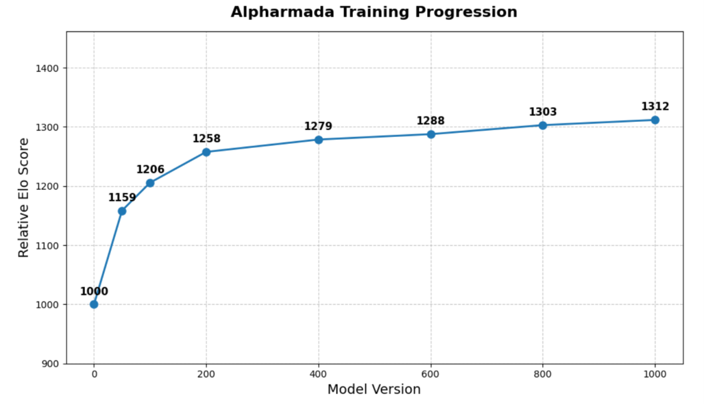

# AlphArmada Project Summary

AlphArmada is an AlphaZero-style self-play system for a simplified Star Wars:
Armada environment. It learns ship activation, attack, repair, defense-token,
and maneuver decisions from self-play using a Cython game engine, batched MCTS,
a PyTorch neural network, disk replay buffers, and Vessl-based distributed
workers. Repository: <https://github.com/tantive4/AlphArmada>.

## Core Implementation

- **Game engine:** `armada_game/core` implements the Armada state machine in
  Cython: ships, hull zones, shields, defense tokens, attacks, dice, damage,
  repairs, navigation charts, movement, activation, and terminal scoring.
- **Current game scope:** ship-focused play with Rebel/Empire fleets. Fleet
  composition and deployment are randomly initialized for self-play. Squadrons,
  command stacks, and obstacles are disabled in the active training config.
- **Chance handling:** attack dice are explicit chance nodes, not policy
  decisions, so MCTS samples dice outcomes while preserving player decisions for
  AlphaZero training targets.

## Model Structure

`BigDeep` is a transformer-centric sandwich architecture:

- Encode the current game into structured tensors for global state, ships,
  defense tokens, spatial threat maps, and pairwise ship relations.
- Embed the scalar game-state token and ship entity tokens into a
  256-dimensional token stream.
- Use the scalar token like a BART-style CLS token: it summarizes the global
  game state and feeds the value, raw-point, hull, and game-length auxiliary
  heads.
- Use AlphaStar-inspired entity attention so ships can attend to other ships
  through learned geometric relation bias instead of relying on fixed fleet
  ordering.
- Fuse defense-token embeddings and Fourier coordinate features into the ship
  reasoning path.
- Run a 3-layer geometry-aware transformer over the scalar and ship tokens.
- Scatter ship tokens into spatial presence/threat maps using an
  AlphaStar-minimap-inspired connection, process them with a 6-block ResNet,
  then gather spatial context back into the token stream with a custom gather
  connection.
- Run a second 3-layer transformer for tactical reasoning after spatial fusion.
- Fuse the scalar token with the active-ship token to form the action-policy
  token used by the policy heads.
- Use pointer heads to choose permutation-free entity actions such as attack
  targets and defense tokens, while static heads handle fixed action choices.

 

## MCTS / AlphaZero Loop

Self-play uses Cython MCTS in `learning/mcts/para_mcts.pyx` for batched
gameplay across many parallel games. At each decision node the state is
encoded, `BigDeep` predicts policy/value, invalid actions are masked, children
are expanded with policy priors, and values are backed up with a PUCT-style
selection rule. Dirichlet root noise drives exploration during self-play. The
stored policy target is the normalized root visit-count distribution.

Default search/training settings include 200 simulations for deep searches, 50
for fast searches, a 25% deep-search replay-saving ratio, temperature decay by
round, 128 parallel self-play games per worker batch, and replay chunks loaded
as disk-backed memmaps.

## Distributed Training Workflow

The reported training process took about 10 days: 20 GTX1080 Vessl workers
created 512k self-play game replays, about 40M encoded states, while training
ran in parallel on a MacBook Pro for 1000 iterations.

- **Workers:** download the newest checkpoint, run batched self-play, save
  replay arrays and MCTS policies, then upload replay buffers plus timestamp
  commit flags.
- **Downloader:** polls worker timestamps, downloads new buffers, aggregates
  every 8 worker outputs, shuffles samples, and writes replay chunks.
- **Trainer:** waits for at least 4 chunks, keeps a 40-chunk sliding window,
  trains with AdamW, saves `model_iter_XXX.pth`, and uploads checkpoints.

The loss combines policy cross entropy, value MSE, raw point prediction,
per-ship hull regression, and game-length classification. The model achieved a
+312 relative Elo gain by version 1000.

## Evaluation

Model strength was estimated with combinatorial matchups among versions v0,
v200, v400, v600, v800, and v1000 using `evaluation/evaluation.py`: each
matchup runs 128 games with 200 MCTS iterations per model decision and disables
root noise during evaluation. For the final human matchup, `shared_mcts.pyx`
used 128 copied game states and 100 shared-tree iterations, for 12,800 total
search paths.

